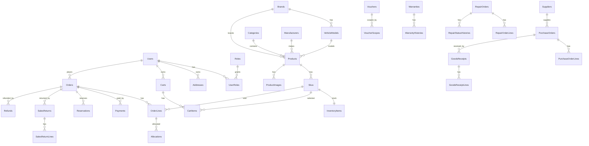

# MoToSale v2 - Giải thích chi tiết database

Tài liệu này được rà theo code hiện tại trong:

- `backend/src/MoToSale.Repository/AppDbContext.cs`
- `backend/src/MoToSale.Entities/**`
- `backend/src/MoToSale.Repository/Configurations/**`

Mục tiêu: dùng để giải thích database khi bảo vệ BTL. Nội dung bên dưới bám theo entity và EF Core configuration hiện tại, không tự thêm bảng hoặc quan hệ không có trong code.

## Quy ước chung

### `BaseEntity`

Gần như mọi bảng entity chính đều kế thừa `BaseEntity`, nên có các cột chung sau:

| Cột | Kiểu C# | Ý nghĩa |
| --- | --- | --- |
| `Id` | `int` | Khóa chính của bảng. |
| `CreatedDate` | `DateTime` | Thời điểm tạo bản ghi. |
| `UpdatedDate` | `DateTime?` | Thời điểm cập nhật gần nhất, có thể null. |
| `Status` | `int` | Trạng thái chung: `-1 = Deleted`, `0 = Inactive`, `1 = Active`. |

Riêng `UserRoles` là bảng nối nhiều-nhiều nên không kế thừa `BaseEntity`.

### Cách đọc quan hệ

- `Restrict`: không cho xóa bản ghi cha nếu còn bản ghi con đang tham chiếu.
- `Cascade`: xóa cha thì EF có thể xóa luôn bản ghi con.
- Nếu một cột có tên dạng `...Id` nhưng trong EF configuration chưa khai báo `HasForeignKey`, tài liệu sẽ ghi là **tham chiếu logic**, không ghi là FK cứng.

## Nhóm tài khoản và phân quyền

### `Users`

Lưu tài khoản người dùng: admin, nhân viên, khách hàng.

| Cột | Kiểu C# | Ràng buộc theo code | Ý nghĩa |
| --- | --- | --- | --- |
| `Id`, `CreatedDate`, `UpdatedDate`, `Status` | BaseEntity | Có sẵn từ `BaseEntity` | Cột chung. |
| `FullName` | `string` | Bắt buộc, max 150 | Họ tên người dùng. |
| `Email` | `string` | Bắt buộc, max 255, unique | Email đăng nhập, không được trùng. |
| `PhoneNumber` | `string?` | Max 20 | Số điện thoại. |
| `PasswordHash` | `string` | Bắt buộc, max 500 | Mật khẩu đã băm. |
| `CareNote` | `string?` | Max 1000 | Ghi chú chăm sóc khách hàng. |

Quan hệ:

- `Users 1-n Addresses`
- `Users n-n Roles` thông qua `UserRoles`
- Được nhiều bảng khác tham chiếu: `Orders`, `Payments`, `AuditLogs`, `Reviews`, `Warranties`, `StockDocuments`, `StockMovements`, ...

### `Roles`

Lưu các vai trò trong hệ thống.

| Cột | Kiểu C# | Ràng buộc theo code | Ý nghĩa |
| --- | --- | --- | --- |
| `Id`, `CreatedDate`, `UpdatedDate`, `Status` | BaseEntity | Có sẵn từ `BaseEntity` | Cột chung. |
| `Code` | `string` | Bắt buộc, max 30, unique | Mã vai trò: `Admin`, `Staff`, `Customer`. |
| `Name` | `string` | Bắt buộc, max 100 | Tên hiển thị của vai trò. |

Seed mặc định:

- `Admin`
- `Staff`
- `Customer`

Quan hệ:

- `Roles n-n Users` thông qua `UserRoles`.

### `UserRoles`

Bảng nối giữa user và role.

| Cột | Kiểu C# | Ràng buộc theo code | Ý nghĩa |
| --- | --- | --- | --- |
| `UserId` | `int` | Khóa chính phần 1, FK tới `Users.Id` | Tài khoản được gán quyền. |
| `RoleId` | `int` | Khóa chính phần 2, FK tới `Roles.Id` | Quyền được gán. |

Khóa chính:

- Composite key: `(UserId, RoleId)`.

Quan hệ:

- `Users 1-n UserRoles`
- `Roles 1-n UserRoles`

### `Addresses`

Lưu địa chỉ nhận hàng của khách hàng.

| Cột | Kiểu C# | Ràng buộc theo code | Ý nghĩa |
| --- | --- | --- | --- |
| `Id`, `CreatedDate`, `UpdatedDate`, `Status` | BaseEntity | Có sẵn từ `BaseEntity` | Cột chung. |
| `UserId` | `int` | FK tới `Users.Id` | Chủ sở hữu địa chỉ. |
| `RecipientName` | `string` | Bắt buộc, max 150 | Tên người nhận. |
| `Phone` | `string` | Bắt buộc, max 20 | Số điện thoại người nhận. |
| `Line` | `string` | Bắt buộc, max 255 | Địa chỉ chi tiết: số nhà, đường. |
| `Ward` | `string?` | Max 100 | Phường/xã. |
| `District` | `string?` | Max 100 | Quận/huyện. |
| `Province` | `string?` | Max 100 | Tỉnh/thành phố. |
| `IsDefault` | `bool` | Không cấu hình riêng | Có phải địa chỉ mặc định hay không. |

Quan hệ:

- `Users 1-n Addresses`.

## Nhóm danh mục và sản phẩm

### `Brands`

Lưu hãng xe, ví dụ Honda, Yamaha.

| Cột | Kiểu C# | Ràng buộc theo code | Ý nghĩa |
| --- | --- | --- | --- |
| `Id`, `CreatedDate`, `UpdatedDate`, `Status` | BaseEntity | Có sẵn từ `BaseEntity` | Cột chung. |
| `Name` | `string` | Bắt buộc, max 100 | Tên hãng xe. |
| `Slug` | `string` | Bắt buộc, max 150, unique | Chuỗi URL thân thiện. |
| `LogoUrl` | `string?` | Max 500 | Link logo hãng xe. |

Quan hệ:

- `Brands 1-n VehicleModels`
- `Brands 1-n Products` qua `Products.BrandId`
- Có thể được `PartCompatibilities.BrandId` tham chiếu.

### `Manufacturers`

Lưu hãng sản xuất phụ tùng, tách riêng với hãng xe.

| Cột | Kiểu C# | Ràng buộc theo code | Ý nghĩa |
| --- | --- | --- | --- |
| `Id`, `CreatedDate`, `UpdatedDate`, `Status` | BaseEntity | Có sẵn từ `BaseEntity` | Cột chung. |
| `Name` | `string` | Bắt buộc, max 120, unique | Tên hãng sản xuất phụ tùng. |
| `LogoUrl` | `string?` | Max 500 | Link logo. |
| `Description` | `string?` | Max 500 | Mô tả ngắn. |

Quan hệ:

- `Manufacturers 1-n Products` qua `Products.ManufacturerId`.

### `VehicleModels`

Lưu dòng xe/model xe của một hãng.

| Cột | Kiểu C# | Ràng buộc theo code | Ý nghĩa |
| --- | --- | --- | --- |
| `Id`, `CreatedDate`, `UpdatedDate`, `Status` | BaseEntity | Có sẵn từ `BaseEntity` | Cột chung. |
| `BrandId` | `int` | FK tới `Brands.Id` | Hãng xe sở hữu model. |
| `Name` | `string` | Bắt buộc, max 120 | Tên model xe. |
| `Slug` | `string` | Bắt buộc, max 160, unique | Chuỗi URL thân thiện. |

Quan hệ:

- `Brands 1-n VehicleModels`
- `VehicleModels 1-n Products` qua `Products.VehicleModelId`
- Có thể được `PartCompatibilities.VehicleModelId` tham chiếu.

### `Categories`

Lưu danh mục sản phẩm, có hỗ trợ danh mục cha-con.

| Cột | Kiểu C# | Ràng buộc theo code | Ý nghĩa |
| --- | --- | --- | --- |
| `Id`, `CreatedDate`, `UpdatedDate`, `Status` | BaseEntity | Có sẵn từ `BaseEntity` | Cột chung. |
| `ParentId` | `int?` | FK tới `Categories.Id`, delete restrict | Danh mục cha, null nếu là danh mục gốc. |
| `Name` | `string` | Bắt buộc, max 150 | Tên danh mục. |
| `Slug` | `string` | Bắt buộc, max 180, unique | Chuỗi URL thân thiện. |
| `Kind` | `int` | Không cấu hình riêng | Loại sản phẩm theo `ProductKind`, ví dụ xe máy/phụ tùng. |
| `SortOrder` | `int` | Không cấu hình riêng | Thứ tự hiển thị. |

Quan hệ:

- `Categories 1-n Categories` qua `ParentId`.
- `Categories 1-n Products`.

### `Products`

Lưu sản phẩm bán trên hệ thống.

| Cột | Kiểu C# | Ràng buộc theo code | Ý nghĩa |
| --- | --- | --- | --- |
| `Id`, `CreatedDate`, `UpdatedDate`, `Status` | BaseEntity | Có sẵn từ `BaseEntity` | Cột chung. |
| `Code` | `string` | Bắt buộc, max 50, unique | Mã sản phẩm. |
| `Name` | `string` | Bắt buộc, max 255 | Tên sản phẩm. |
| `Slug` | `string` | Bắt buộc, max 280, unique | Chuỗi URL thân thiện. |
| `CategoryId` | `int` | FK tới `Categories.Id`, restrict | Danh mục sản phẩm. |
| `BrandId` | `int?` | FK tới `Brands.Id`, restrict | Hãng xe, thường dùng cho xe máy. |
| `VehicleModelId` | `int?` | FK tới `VehicleModels.Id`, restrict | Dòng xe gắn với sản phẩm. |
| `ManufacturerId` | `int?` | FK tới `Manufacturers.Id`, restrict | Hãng sản xuất phụ tùng. |
| `Kind` | `int` | Không cấu hình riêng | Loại sản phẩm theo `ProductKind`. |
| `ShortDescription` | `string?` | Max 500 | Mô tả ngắn. |
| `Description` | `string?` | Không cấu hình riêng | Mô tả chi tiết. |
| `IsFeatured` | `bool` | Không cấu hình riêng | Có hiển thị nổi bật hay không. |
| `IsHotDeal` | `bool` | Không cấu hình riêng | Có phải sản phẩm hot deal hay không. |

Quan hệ:

- `Products 1-n Skus`
- `Products 1-n ProductImages`
- `Products 1-n Reviews`
- `Products 1-n Favorites` theo logic nghiệp vụ
- `Products` liên kết với chính `Products` qua `ProductRelatedItems`.

### `Skus`

Lưu biến thể bán được của sản phẩm.

| Cột | Kiểu C# | Ràng buộc theo code | Ý nghĩa |
| --- | --- | --- | --- |
| `Id`, `CreatedDate`, `UpdatedDate`, `Status` | BaseEntity | Có sẵn từ `BaseEntity` | Cột chung. |
| `ProductId` | `int` | FK tới `Products.Id` | Sản phẩm cha. |
| `SkuCode` | `string` | Bắt buộc, max 80, unique | Mã SKU. |
| `VariantName` | `string?` | Max 180 | Tên biến thể. |
| `Color` | `string?` | Max 80 | Màu sắc. |
| `Version` | `string?` | Max 100 | Phiên bản. |
| `ListPrice` | `decimal` | Precision 18,2 | Giá niêm yết. |
| `SalePrice` | `decimal?` | Precision 18,2 | Giá bán khuyến mãi, có thể null. |
| `Barcode` | `string?` | Max 80 | Mã vạch. |

Check constraint:

- `ListPrice >= 0`
- `SalePrice` null hoặc `0 <= SalePrice <= ListPrice`

Quan hệ:

- `Products 1-n Skus`
- `Skus 1-1 InventoryItems`
- Được tham chiếu bởi giỏ hàng, đơn hàng, kho, bảo hành, sửa chữa, nhập hàng.

### `ProductImages`

Lưu ảnh của sản phẩm.

| Cột | Kiểu C# | Ràng buộc theo code | Ý nghĩa |
| --- | --- | --- | --- |
| `Id`, `CreatedDate`, `UpdatedDate`, `Status` | BaseEntity | Có sẵn từ `BaseEntity` | Cột chung. |
| `ProductId` | `int` | FK tới `Products.Id` | Sản phẩm có ảnh. |
| `SkuId` | `int?` | FK tới `Skus.Id`, restrict | Nếu ảnh riêng cho một SKU. |
| `Url` | `string` | Bắt buộc, max 500 | Link ảnh. |
| `Alt` | `string?` | Max 255 | Text mô tả ảnh. |
| `IsPrimary` | `bool` | Không cấu hình riêng | Có phải ảnh chính hay không. |
| `SortOrder` | `int` | Index cùng `ProductId` | Thứ tự hiển thị. |

Index:

- `(ProductId, SortOrder)`
- `(ProductId, SkuId)` unique khi `IsPrimary = 1`, để tránh nhiều ảnh chính cho cùng sản phẩm/SKU.

### `ProductRelatedItems`

Lưu sản phẩm liên quan, phụ kiện, combo hoặc sản phẩm thay thế.

| Cột | Kiểu C# | Ràng buộc theo code | Ý nghĩa |
| --- | --- | --- | --- |
| `Id`, `CreatedDate`, `UpdatedDate`, `Status` | BaseEntity | Có sẵn từ `BaseEntity` | Cột chung. |
| `ProductId` | `int` | FK tới `Products.Id`, restrict | Sản phẩm gốc. |
| `RelatedProductId` | `int` | FK tới `Products.Id`, restrict | Sản phẩm liên quan. |
| `RelationType` | `string` | Bắt buộc, max 30 | Loại quan hệ: `Accessory`, `Bundle`, `Alternative`. |
| `Note` | `string?` | Max 500 | Ghi chú. |
| `SortOrder` | `int` | Không cấu hình riêng | Thứ tự hiển thị. |

Index:

- Unique `(ProductId, RelatedProductId, RelationType)`.

### `PartCompatibilities`

Lưu cấu hình phụ tùng tương thích với hãng xe/dòng xe/năm.

| Cột | Kiểu C# | Ràng buộc theo code | Ý nghĩa |
| --- | --- | --- | --- |
| `Id`, `CreatedDate`, `UpdatedDate`, `Status` | BaseEntity | Có sẵn từ `BaseEntity` | Cột chung. |
| `PartProductId` | `int` | FK tới `Products.Id` | Sản phẩm phụ tùng. |
| `BrandId` | `int?` | FK tới `Brands.Id`, restrict | Hãng xe áp dụng. |
| `VehicleModelId` | `int?` | FK tới `VehicleModels.Id`, restrict | Dòng xe áp dụng. |
| `YearFrom` | `short?` | Không cấu hình riêng | Năm bắt đầu áp dụng. |
| `YearTo` | `short?` | Không cấu hình riêng | Năm kết thúc áp dụng. |
| `AppliesToAll` | `bool` | Không cấu hình riêng | Áp dụng cho tất cả xe trong phạm vi đã chọn. |
| `Note` | `string?` | Max 500 | Ghi chú. |

Check constraint:

- Nếu có cả `YearFrom` và `YearTo` thì `YearFrom <= YearTo`.

### `Favorites`

Lưu sản phẩm yêu thích của khách hàng.

| Cột | Kiểu C# | Ràng buộc theo code | Ý nghĩa |
| --- | --- | --- | --- |
| `Id`, `CreatedDate`, `UpdatedDate`, `Status` | BaseEntity | Có sẵn từ `BaseEntity` | Cột chung. |
| `UserId` | `int` | Tham chiếu logic tới `Users.Id` | Khách hàng yêu thích sản phẩm. |
| `ProductId` | `int` | Tham chiếu logic tới `Products.Id` | Sản phẩm được yêu thích. |

Ghi chú: entity có hai cột id, nhưng configuration hiện tại chưa khai báo FK/index riêng cho bảng này.

## Nhóm kho

### `InventoryItems`

Lưu tồn kho hiện tại theo từng SKU.

| Cột | Kiểu C# | Ràng buộc theo code | Ý nghĩa |
| --- | --- | --- | --- |
| `Id`, `CreatedDate`, `UpdatedDate`, `Status` | BaseEntity | Có sẵn từ `BaseEntity` | Cột chung. |
| `SkuId` | `int` | FK tới `Skus.Id`, unique, restrict | SKU đang quản lý tồn. |
| `OnHand` | `int` | Check `>= 0` | Số lượng đang có trong kho. |
| `Reserved` | `int` | Check `>= 0` và `<= OnHand` | Số lượng đang giữ cho đơn hàng. |
| `ReorderPoint` | `int` | Check `>= 0` | Ngưỡng cảnh báo sắp hết hàng. |
| `Available` | Computed C# | Không map DB | `OnHand - Reserved`, chỉ tính trong code. |

Quan hệ:

- `Skus 1-1 InventoryItems`.

### `StockMovements`

Lưu sổ kho, mỗi dòng là một lần tăng/giảm tồn. `AppDbContext` chặn sửa/xóa `StockMovement`, nên bảng này là append-only.

| Cột | Kiểu C# | Ràng buộc theo code | Ý nghĩa |
| --- | --- | --- | --- |
| `Id`, `CreatedDate`, `UpdatedDate`, `Status` | BaseEntity | Có sẵn từ `BaseEntity` | Cột chung. |
| `SkuId` | `int` | FK tới `Skus.Id`, restrict | SKU bị thay đổi tồn. |
| `Type` | `int` | Không cấu hình riêng | Loại phát sinh kho theo `StockMovementType`. |
| `QtyDelta` | `int` | Check `<> 0` | Số lượng thay đổi, dương là nhập, âm là xuất. |
| `BalanceAfter` | `int` | Check `>= 0` | Tồn sau khi phát sinh. |
| `RefType` | `string?` | Max 40 | Loại chứng từ nguồn, ví dụ `StockDocument`, `Order`, `RepairOrder`. |
| `RefId` | `int?` | Không cấu hình riêng | Id chứng từ nguồn. |
| `Reason` | `string?` | Max 500 | Lý do phát sinh. |
| `PerformedBy` | `int?` | FK tới `Users.Id`, restrict | Người thực hiện. |
| `OccurredAt` | `DateTime` | `datetime2(0)` | Thời điểm phát sinh. |

Index:

- `(SkuId, OccurredAt)`.

### `StockDocuments`

Lưu phiếu kho: nhập, xuất, điều chỉnh.

| Cột | Kiểu C# | Ràng buộc theo code | Ý nghĩa |
| --- | --- | --- | --- |
| `Id`, `CreatedDate`, `UpdatedDate`, `Status` | BaseEntity | Có sẵn từ `BaseEntity` | Cột chung. |
| `Code` | `string` | Bắt buộc, max 40, unique | Mã phiếu kho. |
| `Type` | `int` | Không cấu hình riêng | Loại phiếu theo `StockDocumentType`. |
| `DocStatus` | `string` | Bắt buộc, max 20, non-unicode | Trạng thái phiếu, ví dụ `Draft`, `Approved`, `Cancelled`. |
| `Note` | `string?` | Max 1000 | Ghi chú. |
| `CreatedBy` | `int?` | FK tới `Users.Id`, restrict | Người tạo phiếu. |
| `ApprovedBy` | `int?` | FK tới `Users.Id`, restrict | Người duyệt phiếu. |
| `ApprovedAt` | `DateTime?` | `datetime2(0)` | Thời điểm duyệt. |

Quan hệ:

- `StockDocuments 1-n StockDocumentLines`.

### `StockDocumentLines`

Lưu dòng chi tiết của phiếu kho.

| Cột | Kiểu C# | Ràng buộc theo code | Ý nghĩa |
| --- | --- | --- | --- |
| `Id`, `CreatedDate`, `UpdatedDate`, `Status` | BaseEntity | Có sẵn từ `BaseEntity` | Cột chung. |
| `StockDocumentId` | `int` | FK tới `StockDocuments.Id` | Phiếu kho cha. |
| `SkuId` | `int` | FK tới `Skus.Id`, restrict | SKU trên dòng phiếu. |
| `Qty` | `int` | Check `> 0` | Số lượng. |
| `Note` | `string?` | Max 500 | Ghi chú dòng. |

### `Reservations`

Lưu số lượng tồn đang giữ cho đơn hàng.

| Cột | Kiểu C# | Ràng buộc theo code | Ý nghĩa |
| --- | --- | --- | --- |
| `Id`, `CreatedDate`, `UpdatedDate`, `Status` | BaseEntity | Có sẵn từ `BaseEntity` | Cột chung. |
| `OrderId` | `int` | FK tới `Orders.Id`, restrict | Đơn hàng được giữ hàng. |
| `OrderLineId` | `int` | FK tới `OrderLines.Id`, restrict | Dòng đơn hàng được giữ hàng. |
| `SkuId` | `int` | FK tới `Skus.Id`, restrict | SKU đang giữ. |
| `Qty` | `int` | Check `> 0` | Số lượng giữ. |
| `ReservationStatus` | `string` | Bắt buộc, max 20, non-unicode | Trạng thái giữ hàng, ví dụ `Active`, `Confirmed`, `Expired`. |
| `ExpiresAt` | `DateTime` | `datetime2(0)` | Hạn giữ hàng. |

Index:

- `(SkuId, ReservationStatus)`
- `OrderId`

## Nhóm giỏ hàng, đơn hàng và voucher

### `Carts`

Lưu giỏ hàng của user.

| Cột | Kiểu C# | Ràng buộc theo code | Ý nghĩa |
| --- | --- | --- | --- |
| `Id`, `CreatedDate`, `UpdatedDate`, `Status` | BaseEntity | Có sẵn từ `BaseEntity` | Cột chung. |
| `UserId` | `int` | FK tới `Users.Id`, restrict, có index | Chủ giỏ hàng. |

Quan hệ:

- `Carts 1-n CartItems`.

### `CartItems`

Lưu dòng sản phẩm trong giỏ hàng.

| Cột | Kiểu C# | Ràng buộc theo code | Ý nghĩa |
| --- | --- | --- | --- |
| `Id`, `CreatedDate`, `UpdatedDate`, `Status` | BaseEntity | Có sẵn từ `BaseEntity` | Cột chung. |
| `CartId` | `int` | FK tới `Carts.Id` | Giỏ hàng cha. |
| `SkuId` | `int` | FK tới `Skus.Id`, restrict | SKU trong giỏ. |
| `Qty` | `int` | Check `> 0` | Số lượng. |
| `UnitPriceSnapshot` | `decimal` | Precision 18,2, check `>= 0` | Giá tại thời điểm thêm vào giỏ. |

### `Orders`

Lưu thông tin đơn hàng.

| Cột | Kiểu C# | Ràng buộc theo code | Ý nghĩa |
| --- | --- | --- | --- |
| `Id`, `CreatedDate`, `UpdatedDate`, `Status` | BaseEntity | Có sẵn từ `BaseEntity` | Cột chung. |
| `Code` | `string` | Bắt buộc, max 40, unique | Mã đơn hàng. |
| `UserId` | `int` | FK tới `Users.Id`, restrict, có index | Khách hàng đặt đơn. |
| `Channel` | `string` | Max 20, non-unicode | Kênh bán, ví dụ `Online`, `POS`. |
| `OrderType` | `string` | Max 20, non-unicode | Loại đơn: thanh toán đủ, đặt cọc, trả góp. |
| `OrderStatus` | `string` | Max 20, non-unicode | Trạng thái đơn. |
| `PaymentMethod` | `string` | Max 20, non-unicode, default `COD` | Phương thức thanh toán. |
| `PaymentStatus` | `string` | Max 20, non-unicode | Trạng thái thanh toán. |
| `FulfillmentStatus` | `string` | Max 20, non-unicode | Trạng thái xử lý/giao hàng. |
| `VoucherId` | `int?` | Tham chiếu logic tới `Vouchers.Id` | Voucher đã áp dụng. Code dùng để tính lượt và hoàn lượt khi hủy. |
| `Subtotal` | `decimal` | Precision 18,2, check `>= 0` | Tổng tiền hàng trước giảm giá/ship. |
| `DiscountTotal` | `decimal` | Precision 18,2, check `>= 0` | Tổng tiền giảm giá. |
| `ShippingFee` | `decimal` | Precision 18,2, check `>= 0` | Phí giao hàng. |
| `GrandTotal` | `decimal` | Precision 18,2, check `>= 0` | Tổng phải trả. |
| `DepositAmount` | `decimal` | Precision 18,2, check `>= 0` | Tiền cọc. |
| `RemainingAmount` | `decimal` | Precision 18,2, check `>= 0` | Tiền còn lại. |
| `ShippingRecipient` | `string` | Max 150 | Tên người nhận. |
| `ShippingPhone` | `string` | Max 20 | Số điện thoại nhận hàng. |
| `ShippingEmail` | `string?` | Max 255 | Email người nhận. |
| `ShippingAddress` | `string?` | Max 500 | Địa chỉ nhận hàng. |
| `ReceivingMethod` | `string` | Max 20, non-unicode | Cách nhận: `Delivery` hoặc `Pickup`. |
| `Note` | `string?` | Max 1000 | Ghi chú của đơn. |
| `FulfillmentNote` | `string?` | Max 1000 | Ghi chú xử lý/giao hàng. |
| `PickupAppointmentAt` | `DateTime?` | `datetime2(0)` | Lịch hẹn nhận tại cửa hàng. |
| `PlacedAt` | `DateTime?` | `datetime2(0)` | Thời điểm đặt đơn. |

Check constraint:

- `Subtotal`, `DiscountTotal`, `ShippingFee`, `GrandTotal`, `DepositAmount`, `RemainingAmount` đều không âm.

Quan hệ:

- `Orders 1-n OrderLines`
- `Orders 1-n Payments`
- `Orders 1-n Reservations`
- `Orders 1-n OrderStatusHistories`
- Được tham chiếu bởi bảo hành, trả hàng, hoàn tiền.

### `OrderLines`

Lưu chi tiết sản phẩm trong đơn hàng.

| Cột | Kiểu C# | Ràng buộc theo code | Ý nghĩa |
| --- | --- | --- | --- |
| `Id`, `CreatedDate`, `UpdatedDate`, `Status` | BaseEntity | Có sẵn từ `BaseEntity` | Cột chung. |
| `OrderId` | `int` | FK tới `Orders.Id` | Đơn hàng cha. |
| `SkuId` | `int` | FK tới `Skus.Id`, restrict | SKU bán ra. |
| `ProductNameSnapshot` | `string` | Max 255 | Tên sản phẩm tại thời điểm đặt hàng. |
| `SkuCodeSnapshot` | `string` | Max 80 | Mã SKU tại thời điểm đặt hàng. |
| `UnitPrice` | `decimal` | Precision 18,2, check `>= 0` | Đơn giá. |
| `Qty` | `int` | Check `> 0` | Số lượng. |
| `LineTotal` | `decimal` | Precision 18,2, check `>= 0` | Thành tiền dòng. |

Quan hệ:

- `OrderLines 1-n Allocations`.
- Được `Reservations`, `Warranties`, `SalesReturnLines` tham chiếu.

### `Allocations`

Lưu phân bổ số lượng cho từng dòng đơn.

| Cột | Kiểu C# | Ràng buộc theo code | Ý nghĩa |
| --- | --- | --- | --- |
| `Id`, `CreatedDate`, `UpdatedDate`, `Status` | BaseEntity | Có sẵn từ `BaseEntity` | Cột chung. |
| `OrderLineId` | `int` | FK tới `OrderLines.Id` | Dòng đơn hàng được phân bổ. |
| `Qty` | `int` | Check `> 0` | Số lượng phân bổ. |
| `AllocationStatus` | `string` | Max 20, non-unicode | Trạng thái phân bổ. |

### `OrderStatusHistories`

Lưu lịch sử đổi trạng thái đơn hàng.

| Cột | Kiểu C# | Ràng buộc theo code | Ý nghĩa |
| --- | --- | --- | --- |
| `Id`, `CreatedDate`, `UpdatedDate`, `Status` | BaseEntity | Có sẵn từ `BaseEntity` | Cột chung. |
| `OrderId` | `int` | FK tới `Orders.Id`, restrict, có index | Đơn hàng được thay đổi. |
| `FromStatus` | `string?` | Max 20, non-unicode | Trạng thái cũ. |
| `ToStatus` | `string` | Max 20, non-unicode | Trạng thái mới. |
| `Note` | `string?` | Max 500 | Ghi chú thay đổi. |
| `ChangedBy` | `int?` | FK tới `Users.Id`, restrict | Người thay đổi. |

### `Vouchers`

Lưu mã giảm giá.

| Cột | Kiểu C# | Ràng buộc theo code | Ý nghĩa |
| --- | --- | --- | --- |
| `Id`, `CreatedDate`, `UpdatedDate`, `Status` | BaseEntity | Có sẵn từ `BaseEntity` | Cột chung. |
| `Code` | `string` | Bắt buộc, max 40, unique | Mã voucher. |
| `Description` | `string?` | Max 255 | Mô tả voucher. |
| `DiscountType` | `string` | Max 20, non-unicode | Kiểu giảm: `Percent` hoặc `Amount`. |
| `DiscountValue` | `decimal` | Precision 18,2, check `> 0` | Giá trị giảm. |
| `MaxDiscount` | `decimal?` | Precision 18,2, check null hoặc `>= 0` | Mức giảm tối đa. |
| `MinOrderValue` | `decimal` | Precision 18,2, check `>= 0` | Giá trị đơn tối thiểu. |
| `UsageLimit` | `int?` | Check null hoặc `> 0` | Tổng số lượt được dùng. |
| `PerUserLimit` | `int?` | Check null hoặc `> 0` | Số lượt mỗi user được dùng. |
| `UsedCount` | `int` | Check `>= 0` | Số lượt đã dùng. |
| `StartAt` | `DateTime?` | `datetime2(0)` | Thời điểm bắt đầu. |
| `EndAt` | `DateTime?` | `datetime2(0)` | Thời điểm kết thúc. |

Check constraint:

- `DiscountValue > 0`
- `MinOrderValue >= 0`
- `MaxDiscount` null hoặc `>= 0`
- `UsageLimit`, `PerUserLimit` null hoặc `> 0`
- `UsedCount >= 0`
- Nếu có cả `StartAt` và `EndAt` thì `StartAt <= EndAt`

### `VoucherScopes`

Lưu phạm vi áp dụng của voucher.

| Cột | Kiểu C# | Ràng buộc theo code | Ý nghĩa |
| --- | --- | --- | --- |
| `Id`, `CreatedDate`, `UpdatedDate`, `Status` | BaseEntity | Có sẵn từ `BaseEntity` | Cột chung. |
| `VoucherId` | `int` | FK tới `Vouchers.Id` | Voucher cha. |
| `ScopeType` | `string` | Bắt buộc, max 20, non-unicode | Loại phạm vi: `Product`, `Category`, `Brand`. |
| `RefId` | `int` | Không cấu hình FK vì phụ thuộc `ScopeType` | Id đối tượng được áp dụng. |

Index:

- Unique `(VoucherId, ScopeType, RefId)`.

## Nhóm thanh toán

### `Payments`

Lưu phiếu thanh toán của đơn hàng.

| Cột | Kiểu C# | Ràng buộc theo code | Ý nghĩa |
| --- | --- | --- | --- |
| `Id`, `CreatedDate`, `UpdatedDate`, `Status` | BaseEntity | Có sẵn từ `BaseEntity` | Cột chung. |
| `Code` | `string` | Bắt buộc, max 40, unique | Mã phiếu thanh toán. |
| `OrderId` | `int` | FK tới `Orders.Id`, restrict, có index | Đơn hàng được thanh toán. |
| `PaymentType` | `string` | Max 20, non-unicode | Loại thu: full, cọc, còn lại, trả góp. |
| `Amount` | `decimal` | Precision 18,2, check `> 0` | Số tiền thanh toán. |
| `Method` | `string` | Max 20, non-unicode | Phương thức: tiền mặt, chuyển khoản... |
| `PaymentRecordStatus` | `string` | Max 20, non-unicode | Trạng thái phiếu thanh toán. |
| `TransactionRef` | `string?` | Max 100 | Mã giao dịch/chứng từ ngân hàng. |
| `Note` | `string?` | Max 500 | Ghi chú. |
| `RecordedBy` | `int?` | FK tới `Users.Id`, restrict | Người ghi nhận. |
| `PaidAt` | `DateTime?` | `datetime2(0)` | Thời điểm thanh toán. |

## Nhóm nội dung website

### `Posts`

Lưu bài viết/blog.

| Cột | Kiểu C# | Ràng buộc theo code | Ý nghĩa |
| --- | --- | --- | --- |
| `Id`, `CreatedDate`, `UpdatedDate`, `Status` | BaseEntity | Có sẵn từ `BaseEntity` | Cột chung. |
| `Title` | `string` | Bắt buộc, max 255 | Tiêu đề bài viết. |
| `Slug` | `string` | Bắt buộc, max 280, unique | URL bài viết. |
| `Summary` | `string?` | Max 500 | Tóm tắt. |
| `Body` | `string` | Không cấu hình riêng | Nội dung bài viết. |
| `CoverUrl` | `string?` | Max 500 | Ảnh bìa. |
| `Category` | `string?` | Max 100 | Chuyên mục bài viết. |
| `PostStatus` | `string` | Max 20, non-unicode | Trạng thái: `Draft`, `Published`. |
| `PublishedAt` | `DateTime?` | `datetime2(0)` | Thời điểm xuất bản. |
| `AuthorId` | `int?` | FK tới `Users.Id`, restrict | Tác giả. |

### `Faqs`

Lưu câu hỏi thường gặp.

| Cột | Kiểu C# | Ràng buộc theo code | Ý nghĩa |
| --- | --- | --- | --- |
| `Id`, `CreatedDate`, `UpdatedDate`, `Status` | BaseEntity | Có sẵn từ `BaseEntity` | Cột chung. |
| `Question` | `string` | Bắt buộc, max 500 | Câu hỏi. |
| `Answer` | `string` | Không cấu hình riêng | Câu trả lời. |
| `Category` | `string?` | Max 100 | Nhóm FAQ. |
| `SortOrder` | `int` | Không cấu hình riêng | Thứ tự hiển thị. |

### `ContactRequests`

Lưu yêu cầu liên hệ của khách từ storefront.

| Cột | Kiểu C# | Ràng buộc theo code | Ý nghĩa |
| --- | --- | --- | --- |
| `Id`, `CreatedDate`, `UpdatedDate`, `Status` | BaseEntity | Có sẵn từ `BaseEntity` | Cột chung. |
| `FullName` | `string` | Bắt buộc, max 150 | Tên người gửi liên hệ. |
| `Phone` | `string` | Bắt buộc, max 20 | Số điện thoại. |
| `Email` | `string?` | Max 255 | Email. |
| `Subject` | `string?` | Max 255 | Tiêu đề liên hệ. |
| `Body` | `string` | Không cấu hình riêng | Nội dung cần tư vấn. |
| `Type` | `string` | Max 30, non-unicode | Loại liên hệ: `General`, `Product`, `TestDrive`, `Consultation`. |
| `ProductId` | `int?` | FK tới `Products.Id`, restrict | Sản phẩm liên quan nếu có. |
| `ContactStatus` | `string` | Max 20, non-unicode | Trạng thái xử lý: `New`, `Processed`. |
| `HandledAt` | `DateTime?` | `datetime2(0)` | Thời điểm xử lý. |

### `HomeBanners`

Lưu banner trang chủ.

| Cột | Kiểu C# | Ràng buộc theo code | Ý nghĩa |
| --- | --- | --- | --- |
| `Id`, `CreatedDate`, `UpdatedDate`, `Status` | BaseEntity | Có sẵn từ `BaseEntity` | Cột chung. |
| `Position` | `string` | Max 30, non-unicode | Vị trí banner: `Slider`, `BannerLeft`, `BannerRight`, `ProductBanner`. |
| `Title` | `string?` | Max 255 | Tiêu đề banner. |
| `ImageUrl` | `string` | Bắt buộc, max 500 | Ảnh banner. |
| `Link` | `string?` | Max 500 | Link khi bấm banner. |
| `SortOrder` | `int` | Không cấu hình riêng | Thứ tự hiển thị. |

## Nhóm đánh giá và bảo hành

### `Reviews`

Lưu đánh giá sản phẩm của khách.

| Cột | Kiểu C# | Ràng buộc theo code | Ý nghĩa |
| --- | --- | --- | --- |
| `Id`, `CreatedDate`, `UpdatedDate`, `Status` | BaseEntity | Có sẵn từ `BaseEntity` | Cột chung. |
| `ProductId` | `int` | FK tới `Products.Id`, restrict | Sản phẩm được đánh giá. |
| `UserId` | `int` | FK tới `Users.Id`, restrict | Khách hàng đánh giá. |
| `OrderId` | `int?` | FK tới `Orders.Id`, restrict | Đơn hàng liên quan nếu có. |
| `Rating` | `int` | Check từ 1 đến 5 | Số sao đánh giá. |
| `Title` | `string?` | Max 255 | Tiêu đề đánh giá. |
| `Comment` | `string?` | Không cấu hình riêng | Nội dung đánh giá. |
| `ImageUrl` | `string?` | Max 500 | Ảnh đính kèm. |
| `ReviewStatus` | `string` | Max 20, non-unicode | Trạng thái: `Pending`, `Approved`, `Rejected`. |

Index:

- `(ProductId, ReviewStatus)`.

### `Warranties`

Lưu phiếu bảo hành.

| Cột | Kiểu C# | Ràng buộc theo code | Ý nghĩa |
| --- | --- | --- | --- |
| `Id`, `CreatedDate`, `UpdatedDate`, `Status` | BaseEntity | Có sẵn từ `BaseEntity` | Cột chung. |
| `Code` | `string` | Bắt buộc, max 40, unique | Mã phiếu bảo hành. |
| `OrderId` | `int?` | FK tới `Orders.Id`, restrict | Đơn hàng gốc. |
| `OrderLineId` | `int?` | FK tới `OrderLines.Id`, restrict | Dòng đơn hàng gốc. |
| `SkuId` | `int?` | FK tới `Skus.Id`, restrict | SKU được bảo hành. |
| `CustomerId` | `int?` | FK tới `Users.Id`, restrict | Khách hàng. |
| `ProductSnapshot` | `string` | Max 255 | Tên sản phẩm tại thời điểm lập bảo hành. |
| `SerialNumber` | `string?` | Max 100 | Số serial nếu có. |
| `CustomerName` | `string?` | Max 150 | Tên khách hàng snapshot. |
| `CustomerPhone` | `string?` | Max 20 | Số điện thoại snapshot. |
| `FrameNumber` | `string?` | Max 100 | Số khung. |
| `EngineNumber` | `string?` | Max 100 | Số máy. |
| `ReportedIssue` | `string` | Max 1000 | Lỗi khách báo. |
| `EstimatedCost` | `decimal?` | Precision 18,2 | Chi phí dự kiến. |
| `ActualCost` | `decimal?` | Precision 18,2 | Chi phí thực tế. |
| `ReceivedAt` | `DateTime` | `datetime2(0)` | Ngày tiếp nhận. |
| `CompletedAt` | `DateTime?` | `datetime2(0)` | Ngày hoàn thành. |
| `StartAt` | `DateTime` | `datetime2(0)` | Ngày bắt đầu bảo hành. |
| `Months` | `int` | Check `> 0` | Số tháng bảo hành. |
| `WarrantyStatus` | `string` | Max 20, non-unicode | Trạng thái: `Active`, `Expired`, `Void`. |
| `Note` | `string?` | Max 500 | Ghi chú. |

### `WarrantyHistories`

Lưu lịch sử thay đổi trạng thái bảo hành.

| Cột | Kiểu C# | Ràng buộc theo code | Ý nghĩa |
| --- | --- | --- | --- |
| `Id`, `CreatedDate`, `UpdatedDate`, `Status` | BaseEntity | Có sẵn từ `BaseEntity` | Cột chung. |
| `WarrantyId` | `int` | FK tới `Warranties.Id`, cascade, có index | Phiếu bảo hành cha. |
| `FromStatus` | `string?` | Max 20, non-unicode | Trạng thái cũ. |
| `ToStatus` | `string` | Bắt buộc, max 20, non-unicode | Trạng thái mới. |
| `Note` | `string?` | Max 1000 | Ghi chú. |
| `ActualCost` | `decimal?` | Precision 18,2 | Chi phí thực tế khi cập nhật. |
| `ChangedBy` | `int?` | FK tới `Users.Id`, restrict | Người cập nhật. |

## Nhóm trả hàng, hoàn tiền, trả góp và nhân sự

### `SalesReturns`

Lưu phiếu trả hàng.

| Cột | Kiểu C# | Ràng buộc theo code | Ý nghĩa |
| --- | --- | --- | --- |
| `Id`, `CreatedDate`, `UpdatedDate`, `Status` | BaseEntity | Có sẵn từ `BaseEntity` | Cột chung. |
| `Code` | `string` | Bắt buộc, max 40, unique | Mã phiếu trả hàng. |
| `OrderId` | `int` | FK tới `Orders.Id`, restrict, có index | Đơn hàng bị trả. |
| `ReturnStatus` | `string` | Bắt buộc, max 20, non-unicode | Trạng thái phiếu trả. |
| `Reason` | `string` | Bắt buộc, max 500 | Lý do trả hàng. |
| `Note` | `string?` | Max 1000 | Ghi chú. |
| `RefundAmount` | `decimal` | Precision 18,2, check `>= 0` | Số tiền dự kiến hoàn. |
| `CreatedBy` | `int?` | FK tới `Users.Id`, restrict | Người tạo phiếu. |
| `ApprovedBy` | `int?` | FK tới `Users.Id`, restrict | Người duyệt phiếu. |
| `ApprovedAt` | `DateTime?` | `datetime2(0)` | Thời điểm duyệt. |

Quan hệ:

- `SalesReturns 1-n SalesReturnLines`.

### `SalesReturnLines`

Lưu sản phẩm trong phiếu trả hàng.

| Cột | Kiểu C# | Ràng buộc theo code | Ý nghĩa |
| --- | --- | --- | --- |
| `Id`, `CreatedDate`, `UpdatedDate`, `Status` | BaseEntity | Có sẵn từ `BaseEntity` | Cột chung. |
| `SalesReturnId` | `int` | FK tới `SalesReturns.Id` | Phiếu trả cha. |
| `OrderLineId` | `int` | FK tới `OrderLines.Id`, restrict | Dòng đơn hàng gốc. |
| `SkuId` | `int` | FK tới `Skus.Id`, restrict | SKU trả lại. |
| `Qty` | `int` | Check `> 0` | Số lượng trả. |
| `UnitPrice` | `decimal` | Precision 18,2, check `>= 0` | Đơn giá hoàn theo dòng. |
| `LineTotal` | `decimal` | Precision 18,2, check `>= 0` | Thành tiền dòng trả. |
| `ItemCondition` | `string` | Bắt buộc, max 20, non-unicode | Tình trạng hàng trả, ví dụ `Resellable`. |

### `Refunds`

Lưu phiếu hoàn tiền.

| Cột | Kiểu C# | Ràng buộc theo code | Ý nghĩa |
| --- | --- | --- | --- |
| `Id`, `CreatedDate`, `UpdatedDate`, `Status` | BaseEntity | Có sẵn từ `BaseEntity` | Cột chung. |
| `Code` | `string` | Bắt buộc, max 40, unique | Mã phiếu hoàn tiền. |
| `OrderId` | `int` | FK tới `Orders.Id`, restrict, có index | Đơn hàng được hoàn tiền. |
| `SalesReturnId` | `int?` | FK tới `SalesReturns.Id`, restrict | Phiếu trả hàng liên quan nếu có. |
| `Amount` | `decimal` | Precision 18,2, check `> 0` | Số tiền hoàn. |
| `Method` | `string` | Max 20, non-unicode | Phương thức hoàn tiền. |
| `RefundStatus` | `string` | Max 20, non-unicode | Trạng thái hoàn tiền. |
| `Reason` | `string?` | Max 500 | Lý do hoàn tiền. |
| `TransactionRef` | `string?` | Max 100 | Mã giao dịch. |
| `RecordedBy` | `int?` | FK tới `Users.Id`, restrict | Người ghi nhận. |
| `RefundedAt` | `DateTime` | `datetime2(0)` | Thời điểm hoàn tiền. |

### `InstallmentApplications`

Lưu hồ sơ khách đăng ký tư vấn trả góp.

| Cột | Kiểu C# | Ràng buộc theo code | Ý nghĩa |
| --- | --- | --- | --- |
| `Id`, `CreatedDate`, `UpdatedDate`, `Status` | BaseEntity | Có sẵn từ `BaseEntity` | Cột chung. |
| `Code` | `string` | Không cấu hình riêng | Mã hồ sơ trả góp. |
| `CustomerId` | `int?` | Tham chiếu logic tới `Users.Id` | Khách đã đăng nhập nếu có. |
| `CustomerName` | `string` | Không cấu hình riêng | Tên khách đăng ký. |
| `CustomerPhone` | `string` | Không cấu hình riêng | Số điện thoại khách. |
| `CustomerEmail` | `string?` | Không cấu hình riêng | Email khách. |
| `ProductId` | `int?` | Tham chiếu logic tới `Products.Id` | Sản phẩm quan tâm. |
| `SkuId` | `int?` | Tham chiếu logic tới `Skus.Id` | SKU quan tâm. |
| `ProductSnapshot` | `string` | Không cấu hình riêng | Tên sản phẩm tại thời điểm đăng ký. |
| `FinancePartner` | `string?` | Không cấu hình riêng | Đối tác tài chính mong muốn. |
| `DownPayment` | `decimal` | EF hiện chưa set precision riêng | Tiền trả trước mong muốn. |
| `Months` | `int` | Không cấu hình riêng | Số tháng mong muốn. |
| `Note` | `string?` | Không cấu hình riêng | Ghi chú. |
| `ApplicationStatus` | `string` | Không cấu hình riêng | Trạng thái: `Pending`, `Approved`, `Rejected`. |
| `OrderId` | `int?` | Tham chiếu logic tới `Orders.Id` | Đơn hàng tạo ra khi duyệt. |
| `HandledBy` | `int?` | Tham chiếu logic tới `Users.Id` | Người xử lý. |
| `HandledAt` | `DateTime?` | Không cấu hình riêng | Thời điểm xử lý. |

Ghi chú: file configuration hiện tại không cấu hình FK/length/precision riêng cho bảng này.

## Nhóm mua hàng, sửa chữa, CRM, thu chi

### `Suppliers`

Lưu nhà cung cấp.

| Cột | Kiểu C# | Ràng buộc theo code | Ý nghĩa |
| --- | --- | --- | --- |
| `Id`, `CreatedDate`, `UpdatedDate`, `Status` | BaseEntity | Có sẵn từ `BaseEntity` | Cột chung. |
| `Code` | `string` | Bắt buộc, max 40, unique | Mã nhà cung cấp. |
| `Name` | `string` | Bắt buộc, max 180 | Tên nhà cung cấp. |
| `TaxCode` | `string?` | Max 40 | Mã số thuế. |
| `ContactName` | `string?` | Max 150 | Người liên hệ. |
| `Phone` | `string?` | Max 20 | Số điện thoại. |
| `Email` | `string?` | Max 255 | Email. |
| `Address` | `string?` | Max 500 | Địa chỉ. |
| `Note` | `string?` | Max 1000 | Ghi chú. |

### `PurchaseOrders`

Lưu đơn mua hàng từ nhà cung cấp.

| Cột | Kiểu C# | Ràng buộc theo code | Ý nghĩa |
| --- | --- | --- | --- |
| `Id`, `CreatedDate`, `UpdatedDate`, `Status` | BaseEntity | Có sẵn từ `BaseEntity` | Cột chung. |
| `Code` | `string` | Bắt buộc, max 40, unique | Mã đơn mua. |
| `SupplierId` | `int` | FK tới `Suppliers.Id`, restrict | Nhà cung cấp. |
| `PurchaseStatus` | `string` | Bắt buộc, max 24, non-unicode | Trạng thái đơn mua. |
| `TotalAmount` | `decimal` | Precision 18,2, check `>= 0` | Tổng tiền đơn mua. |
| `PaidAmount` | `decimal` | Precision 18,2, check `>= 0` và `<= TotalAmount` | Số tiền đã trả nhà cung cấp. |
| `Note` | `string?` | Max 1000 | Ghi chú. |
| `CreatedBy` | `int?` | Tham chiếu logic tới `Users.Id` | Người tạo. |
| `ApprovedBy` | `int?` | Tham chiếu logic tới `Users.Id` | Người duyệt. |
| `ApprovedAt` | `DateTime?` | Không cấu hình riêng | Thời điểm duyệt. |

Quan hệ:

- `PurchaseOrders 1-n PurchaseOrderLines`.

### `PurchaseOrderLines`

Lưu dòng chi tiết của đơn mua.

| Cột | Kiểu C# | Ràng buộc theo code | Ý nghĩa |
| --- | --- | --- | --- |
| `Id`, `CreatedDate`, `UpdatedDate`, `Status` | BaseEntity | Có sẵn từ `BaseEntity` | Cột chung. |
| `PurchaseOrderId` | `int` | FK tới `PurchaseOrders.Id` | Đơn mua cha. |
| `SkuId` | `int` | FK tới `Skus.Id`, restrict | SKU cần mua. |
| `OrderedQty` | `int` | Check `> 0` | Số lượng đặt mua. |
| `ReceivedQty` | `int` | Check `>= 0` và `<= OrderedQty` | Số lượng đã nhận. |
| `UnitCost` | `decimal` | Precision 18,2, check `>= 0` | Đơn giá nhập. |

### `GoodsReceipts`

Lưu phiếu nhận hàng từ đơn mua.

| Cột | Kiểu C# | Ràng buộc theo code | Ý nghĩa |
| --- | --- | --- | --- |
| `Id`, `CreatedDate`, `UpdatedDate`, `Status` | BaseEntity | Có sẵn từ `BaseEntity` | Cột chung. |
| `Code` | `string` | Bắt buộc, max 40, unique | Mã phiếu nhận hàng. |
| `PurchaseOrderId` | `int` | FK tới `PurchaseOrders.Id`, restrict | Đơn mua được nhận hàng. |
| `Note` | `string?` | Max 1000 | Ghi chú. |
| `ReceivedBy` | `int?` | Tham chiếu logic tới `Users.Id` | Người nhận hàng. |
| `ReceivedAt` | `DateTime` | Không cấu hình riêng | Thời điểm nhận hàng. |

Quan hệ:

- `GoodsReceipts 1-n GoodsReceiptLines`.

### `GoodsReceiptLines`

Lưu dòng chi tiết của phiếu nhận hàng.

| Cột | Kiểu C# | Ràng buộc theo code | Ý nghĩa |
| --- | --- | --- | --- |
| `Id`, `CreatedDate`, `UpdatedDate`, `Status` | BaseEntity | Có sẵn từ `BaseEntity` | Cột chung. |
| `GoodsReceiptId` | `int` | FK tới `GoodsReceipts.Id` | Phiếu nhận hàng cha. |
| `PurchaseOrderLineId` | `int` | FK tới `PurchaseOrderLines.Id`, restrict | Dòng đơn mua tương ứng. |
| `SkuId` | `int` | FK tới `Skus.Id`, restrict | SKU nhận hàng. |
| `Qty` | `int` | Check `> 0` | Số lượng nhận. |
| `UnitCost` | `decimal` | Precision 18,2, check `>= 0` | Đơn giá nhập. |

### `CashTransactions`

Lưu phiếu thu/chi tiền.

| Cột | Kiểu C# | Ràng buộc theo code | Ý nghĩa |
| --- | --- | --- | --- |
| `Id`, `CreatedDate`, `UpdatedDate`, `Status` | BaseEntity | Có sẵn từ `BaseEntity` | Cột chung. |
| `Code` | `string` | Bắt buộc, max 40, unique | Mã phiếu thu/chi. |
| `TransactionType` | `string` | Bắt buộc, max 20, non-unicode | Loại phiếu: `Receipt` hoặc `Payment`. |
| `Category` | `string` | Bắt buộc, max 60 | Nhóm thu/chi. |
| `Amount` | `decimal` | Precision 18,2, check `> 0` | Số tiền. |
| `Method` | `string` | Max 20, non-unicode | Phương thức tiền mặt/chuyển khoản. |
| `ReferenceType` | `string?` | Max 40 | Loại nghiệp vụ liên quan, ví dụ đơn mua, sửa chữa. |
| `ReferenceId` | `int?` | Không cấu hình riêng | Id bản ghi liên quan. |
| `Note` | `string?` | Max 1000 | Ghi chú. |
| `RecordedBy` | `int?` | Tham chiếu logic tới `Users.Id` | Người ghi nhận. |
| `OccurredAt` | `DateTime` | Không cấu hình riêng | Thời điểm phát sinh. |

### `RepairOrders`

Lưu phiếu sửa chữa/bảo dưỡng.

| Cột | Kiểu C# | Ràng buộc theo code | Ý nghĩa |
| --- | --- | --- | --- |
| `Id`, `CreatedDate`, `UpdatedDate`, `Status` | BaseEntity | Có sẵn từ `BaseEntity` | Cột chung. |
| `Code` | `string` | Bắt buộc, max 40, unique | Mã phiếu sửa chữa. |
| `CustomerId` | `int` | FK tới `Users.Id`, restrict | Khách hàng. |
| `AssignedStaffId` | `int?` | Tham chiếu logic tới `Users.Id` | Nhân viên phụ trách. |
| `WarrantyId` | `int?` | FK tới `Warranties.Id`, restrict | Phiếu bảo hành liên quan nếu có. |
| `VehicleDescription` | `string` | Bắt buộc, max 255 | Mô tả xe. |
| `ReportedIssue` | `string` | Bắt buộc, max 1000 | Lỗi khách báo. |
| `RepairStatus` | `string` | Bắt buộc, max 20, non-unicode | Trạng thái sửa chữa. |
| `LaborCost` | `decimal` | Precision 18,2, check `>= 0` | Tiền công. |
| `PartsCost` | `decimal` | Precision 18,2, check `>= 0` | Tiền phụ tùng. |
| `Note` | `string?` | Max 1000 | Ghi chú. |
| `ReceivedAt` | `DateTime` | Không cấu hình riêng | Thời điểm nhận xe. |
| `CompletedAt` | `DateTime?` | Không cấu hình riêng | Thời điểm hoàn thành. |
| `PartsIssued` | `bool` | Không cấu hình riêng | Đã xuất phụ tùng hay chưa. |

Quan hệ:

- `RepairOrders 1-n RepairOrderLines`
- `RepairOrders 1-n RepairStatusHistories`

### `RepairOrderLines`

Lưu vật tư/công việc trong phiếu sửa chữa.

| Cột | Kiểu C# | Ràng buộc theo code | Ý nghĩa |
| --- | --- | --- | --- |
| `Id`, `CreatedDate`, `UpdatedDate`, `Status` | BaseEntity | Có sẵn từ `BaseEntity` | Cột chung. |
| `RepairOrderId` | `int` | FK tới `RepairOrders.Id` | Phiếu sửa chữa cha. |
| `SkuId` | `int?` | FK tới `Skus.Id`, restrict | Phụ tùng dùng trong sửa chữa, có thể null nếu là công việc dịch vụ. |
| `Description` | `string` | Bắt buộc, max 500 | Mô tả vật tư/công việc. |
| `Qty` | `int` | Check `> 0` | Số lượng. |
| `UnitPrice` | `decimal` | Precision 18,2, check `>= 0` | Đơn giá. |

### `RepairStatusHistories`

Lưu lịch sử trạng thái sửa chữa.

| Cột | Kiểu C# | Ràng buộc theo code | Ý nghĩa |
| --- | --- | --- | --- |
| `Id`, `CreatedDate`, `UpdatedDate`, `Status` | BaseEntity | Có sẵn từ `BaseEntity` | Cột chung. |
| `RepairOrderId` | `int` | FK tới `RepairOrders.Id`, cascade | Phiếu sửa chữa cha. |
| `FromStatus` | `string?` | Max 20, non-unicode | Trạng thái cũ. |
| `ToStatus` | `string` | Bắt buộc, max 20, non-unicode | Trạng thái mới. |
| `Note` | `string?` | Max 1000 | Ghi chú. |
| `ChangedAt` | `DateTime` | Index cùng `RepairOrderId` | Thời điểm thay đổi. |

Index:

- `(RepairOrderId, ChangedAt)`.

### `CustomerInteractions`

Lưu lịch sử chăm sóc/liên hệ khách hàng.

| Cột | Kiểu C# | Ràng buộc theo code | Ý nghĩa |
| --- | --- | --- | --- |
| `Id`, `CreatedDate`, `UpdatedDate`, `Status` | BaseEntity | Có sẵn từ `BaseEntity` | Cột chung. |
| `CustomerId` | `int` | FK tới `Users.Id`, restrict | Khách hàng được chăm sóc. |
| `AssignedStaffId` | `int?` | Tham chiếu logic tới `Users.Id` | Nhân viên phụ trách. |
| `InteractionType` | `string` | Max 20, non-unicode | Loại tương tác, ví dụ cuộc gọi. |
| `InteractionStatus` | `string` | Max 20, non-unicode | Trạng thái tương tác. |
| `Subject` | `string` | Bắt buộc, max 255 | Chủ đề chăm sóc. |
| `Note` | `string?` | Max 1000 | Nội dung/ghi chú. |
| `FollowUpAt` | `DateTime?` | Có index | Lịch hẹn chăm sóc tiếp. |
| `CompletedAt` | `DateTime?` | Không cấu hình riêng | Thời điểm hoàn thành. |

### `StaffAttendances`

Lưu chấm công nhân viên.

| Cột | Kiểu C# | Ràng buộc theo code | Ý nghĩa |
| --- | --- | --- | --- |
| `Id`, `CreatedDate`, `UpdatedDate`, `Status` | BaseEntity | Có sẵn từ `BaseEntity` | Cột chung. |
| `StaffUserId` | `int` | FK tới `Users.Id`, restrict | Nhân viên chấm công. |
| `CheckInAt` | `DateTime` | Index cùng `StaffUserId` | Giờ vào ca. |
| `CheckOutAt` | `DateTime?` | Không cấu hình riêng | Giờ ra ca. |
| `Note` | `string?` | Max 500 | Ghi chú. |

Index:

- `(StaffUserId, CheckInAt)`.

## Nhóm cấu hình và audit

### `Settings`

Lưu cấu hình hệ thống dạng key-value.

| Cột | Kiểu C# | Ràng buộc theo code | Ý nghĩa |
| --- | --- | --- | --- |
| `Id`, `CreatedDate`, `UpdatedDate`, `Status` | BaseEntity | Có sẵn từ `BaseEntity` | Cột chung. |
| `Key` | `string` | Bắt buộc, max 100, unique | Tên khóa cấu hình, ví dụ `StoreName`, `Hotline`, `DefaultShippingFee`. |
| `Value` | `string?` | Không cấu hình riêng | Giá trị cấu hình, lưu dạng chuỗi. |
| `Description` | `string?` | Max 500 | Mô tả ý nghĩa của key. |

### `AuditLogs`

Lưu nhật ký thao tác.

| Cột | Kiểu C# | Ràng buộc theo code | Ý nghĩa |
| --- | --- | --- | --- |
| `Id`, `CreatedDate`, `UpdatedDate`, `Status` | BaseEntity | Có sẵn từ `BaseEntity` | Cột chung. |
| `Entity` | `string` | Bắt buộc, max 100 | Tên đối tượng bị tác động, ví dụ `Order`, `Product`. |
| `EntityId` | `string` | Bắt buộc, max 100 | Id của đối tượng bị tác động. |
| `Action` | `string` | Bắt buộc, max 50 | Hành động, ví dụ create/update/delete/approve. |
| `OldValueJson` | `string?` | Không cấu hình riêng | Giá trị cũ dạng JSON. |
| `NewValueJson` | `string?` | Không cấu hình riêng | Giá trị mới dạng JSON. |
| `ActorId` | `int?` | FK tới `Users.Id`, restrict, có index | Người thực hiện thao tác. |
| `ActorName` | `string?` | Max 150 | Tên người thực hiện tại thời điểm ghi log. |
| `At` | `DateTime` | `datetime2(0)` | Thời điểm thao tác. |

Index:

- `(Entity, EntityId, At)`
- `ActorId`

## Tóm tắt quan hệ quan trọng

## Bảng đã bỏ gần đây

Hai bảng sau đã được bỏ khỏi model hiện tại và có migration drop table:

- `OrderVouchers`
- `VoucherRedemptions`

Lý do: code hiện tại lưu voucher đã dùng trực tiếp bằng `Orders.VoucherId`, số lượt bằng `Vouchers.UsedCount`, tiền giảm bằng `Orders.DiscountTotal`, nên hai bảng này không còn được service đọc/ghi.
